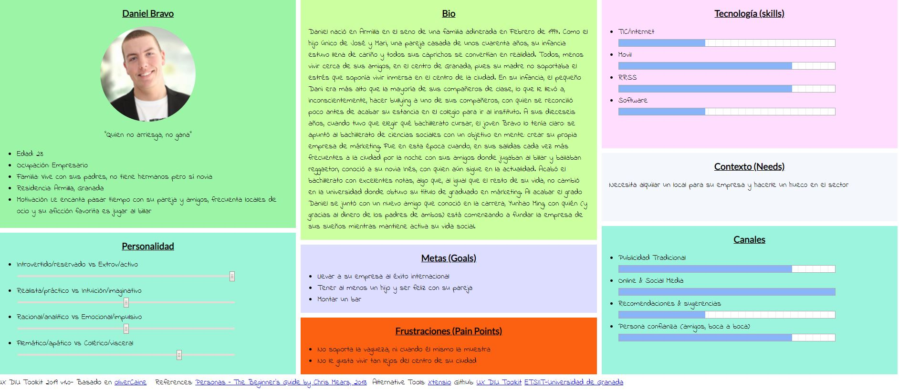
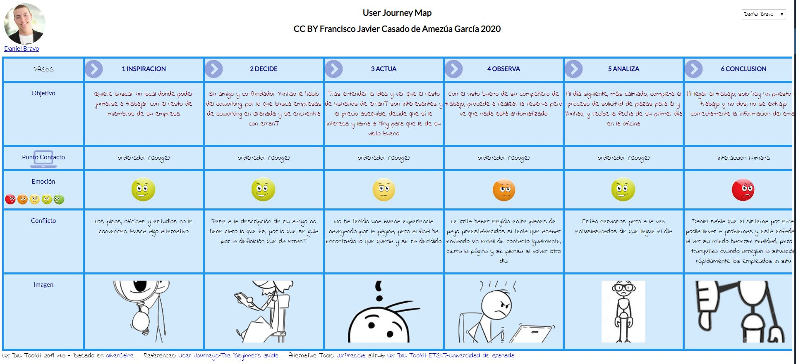
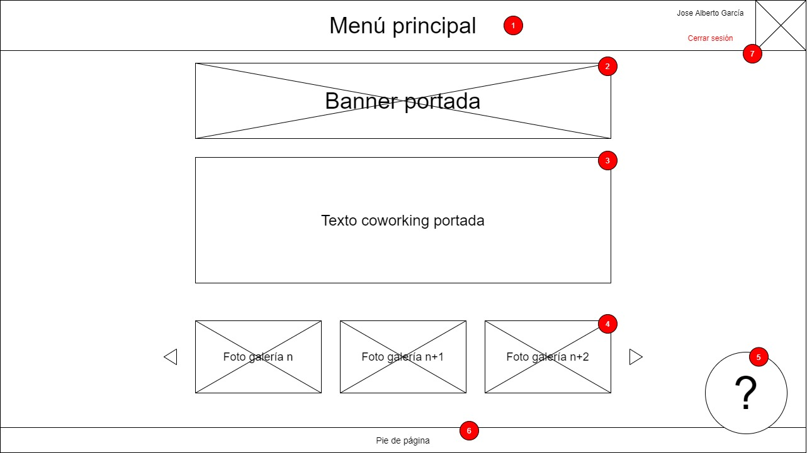
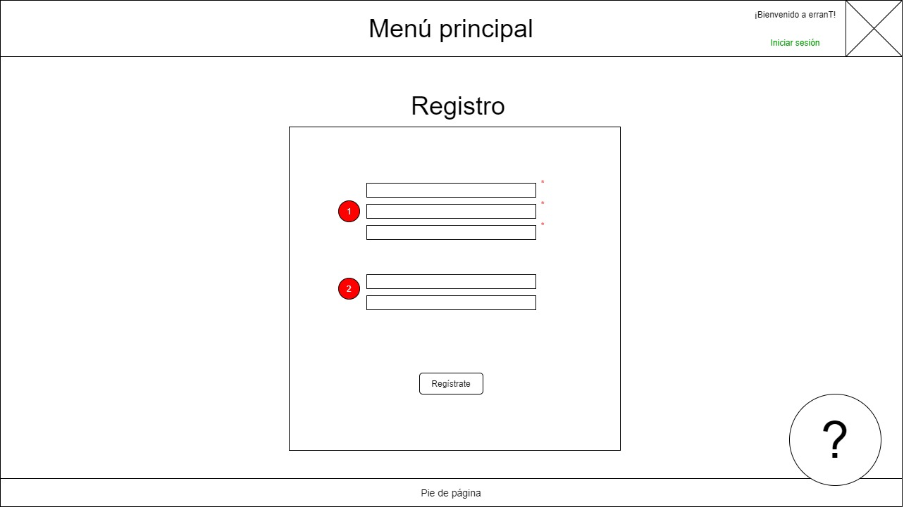
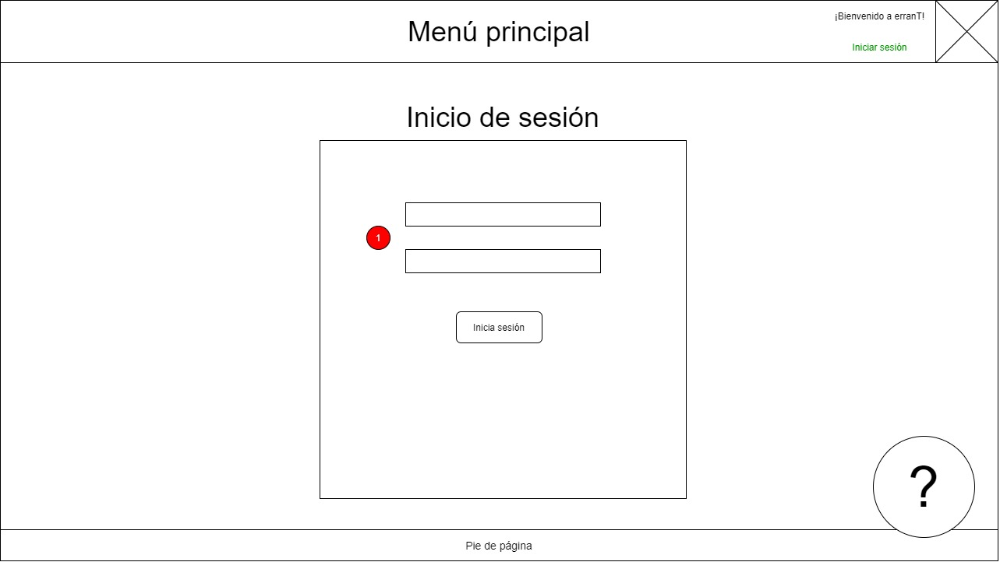

# Rediseño de erranT
Trabajo final de Diseño Interfaces de Usuario 2019-20, Universidad de Granada

Por: Francisco Javier Casado de Amezúa García

Descripción: En este trabajo se realizará una propuesta de valor sobre el rediseño del sitio web de una empresa granadina centrada en coworking, erranT. La propuesta no sugiere únicamente problemas encontrados en la versión actual del portal, si no también cambios y mejoras que aplicar sobre dicho portal para lograr ofrecer una mejor experiencia de usuario.

&nbsp;
# Análisis del diseño actual

Competitive Analysis
-----

En busca de funcionalidades que añadir en el rediseño de la página web, o funcionalidades existentes que permiten a erranT destacar sobre la competencia y que, por ello, han de tener gran importancia en el rediseño, se ha realizado un análisis de la competencia.

Se han utilizado dos competidores que ofrecen sus servicios también en Granada, Cubikate y AndaCowork, para realizar el estudio y comparación. Al hacerlo, se ha descubierto que, si bien todas las páginas comparten un esquema común de qué ofrecer (en general, funcionalidades limitadas orientadas a que el usuario establezca una línea de contacto con la empresa para alcanzar un acuerdo económico para el ofrecimiento del servicio), erranT ofrece un listado de los usuarios que hacen uso del servicio en la actualidad, lo que la destaca sobre las demás. Por otro lado, se ha determinado que los competidores utilizan un estilo de comunicación de la información basado en iconos, más sencillo de interpretar y agradable, así como la oferta de un servicio de oficina virtual orientado a empresas startup o de reciente creación.

Éstas y más diferencias se han recogido en la tabla siguiente:

Portal web | Listado de coworkers | Planes con precio preestablecido | Alquilar sala para reunión | Iconografía para prestaciones | Oficina virtual
| --- | --- | --- | --- | --- | --- |
erranT | ✓ | ✓ | ✓ | ✘ | ✘ |
cubikate | ✘ | ✘ | ✓ | ✓ | ✓ |
andacowork | ✘ | ✓ | ✓ | ✓ | ✓ |

&nbsp;

Persona & User Journey Map
-----
Con el objetivo de tratar de encontrar problemas de accesibilidad o usabilidad en el sitio web se ha utilizado una persona ficticia que encaja en el perfil de uno de los tipos de clientes a los que va orientado nuestro servicio.

Dicha persona es Daniel Bravo, un jóven emprendedor que busca asentar su recién creada startup de márketing en el sector, y acabará intentando hacer uso de erranT para ello.

Para obtener más información sobre Daniel mire la imagen que se muestra a continuación o haga click sobre ella para verla a mayor tamaño.

A continuación se ha imaginado una de las posibles interacciones que Daniel Bravo podría tener con erranT. En él, su experiencia termina con él y su compañero de emprendimiento utilizando los servicios de erranT, pero Daniel encuentra diversas complicaciones y posibles problemas en el proceso de realización de su reserva, que serán tratados en posteriores secciones de este documento.

Para obtener más información sobre esta experiencia de usuario mire la imagen que se muestra a continuación o haga click sobre ella para verla a mayor tamaño.

&nbsp;

Usability Review
----
Se ha realizado un extenso análisis guiado por objetivos del nivel de usabilidad del portal web de erranT, con el objetivo de poder obtener, a partir de éste, conclusiones que ayuden a asegurar la usabilidad de la propuesta de rediseño.
La información acerca del informe, así como un breve resumen de la valoración, se muestran a continuación:

- Enlace al documento: 
- Valoración final (numérica): 69
- Comentario sobre la valoración:
La valoración de usabilidad da un resultado aceptable, pero muestra diferentes aspectos a mejorar al igual que otros positivos que han de aprovecharse a la hora del rediseño. Se recomienda encarecidamente comprobar el documento .xls debido a que se han incluido diversos comentarios a cada criterio evaluado.

Como puntos negativos destaca la ausencia de ayuda al usuario más allá de la que se pueda obtener a través del formulario de contacto, así como el pobre feedback que recibe al usuario al interactuar con la práctica y una navegación mejorable.

Por otra parte, destacan positivamente tanto el sistema de búsqueda que incorpora la página en la actualidad como la ofetra de servicios y funcionalidades, en especial el listado de usuarios, si bien se podría optimizar sustituyendo el trámite mediante formularios de contacto por un sistema de registro y pago online que automatizara el proceso todo lo posible.

&nbsp;

# Propuesta de valor del rediseño 

Listado de mejoras y nuevas ideas
----

A continuación, en base al análisis realizado a lo largo del apartado anterior, se proponen algunas modificaciones así como nuevas ideas que podría implementar la página y que no lo hace ni ésta ni las de los competidores que han sido analizadas:

**Mejoras:**
- Mejora de la estructura de navegación: se eliminan los formularios de contacto duplicados, quedando éste localizado únicamente en la página de contacto. Se elimina también las referencias, en la página principal, a "La Pecera Comunicación", siendo este espacio sustituido por una galería de fotos del local, con el objetivo de cumplir la regla de sencillez (se quiere centrar la atención del usuario en lo más importante).
- Mejora de la experiencia de usuarios noveles: introducción de una sección de ayuda en el menú principal, y enlaces a la misma en cada una de las secciones de la página.
- Mejora de la accesibilidad del sitio web mediante la introducción de una nueva sección enfocada explícitamente para esta finalidad, acessible desde el pie de página de cualquiera de las secciones del portal.
- Pequeñas mejoras de visualización general: centrado de los iconos de redes sociales, cambio de color de la fuente de texto sobre imágenes claras, purga de enlaces rotos y errores de back-end en la versión localizada al idioma inglés.

**Nuevas ideas**
- Pagar online: sistema de pago regular mensual personalizable.
- Elección de estación de trabajo: poder elegir, en un mapa interactivo, qué estación elegir (por supuesto, entre las disponibles). El mapa indicará también los usuarios adyacenetes a cada puesto libre, infromación extraída del listado de usuarios existente.
- Sistema de registro y sesiones de usuario: pese a que parece ser algo evitado por las páginas de coworking, un sistema que garantice el registro y posterior inicio de sesión permitiría agilizar los trámites e interactuaría directamente con el pago online para garantizar su seguridad.

&nbsp;

Tasks
-----

En esta sección listamos las funcionalidades más relevantes del sitio web, ordenándolas de mayor a menor frecuencia de uso general, y analizando si la usaron usuarios noveles, expertos o ambos. Con esto buscamos identificar las tareas que se realizan más a menudo con el sitio web, para poder centrar los esfuerzos de rediseño en ellas:

Tarea | Usuarios noveles | Usuarios experimentados |
| --- | --- | --- | 
Reservar un lugar de trabajo | Alta | Alta |
Iniciar sesión | Alta | Alta |
Visualizar la portada | Alta | Media |
Contactar | Alta | Media |
Pagar de forma online | Media | Media |
Usar ayuda online | Alta | Baja |
Reservar la sala de eventos | Baja | Baja |
Registrarse | Baja | Baja |

Teniendo en cuenta la tabla anterior mejorar el sistema de reservas con la nueva idea de elegir posición del puesto de trabajo y crear un sistema seguro y accesible de inicio de sesión cobran importancia en el rediseño del sitio web, como también lo hace reestructura la portada para que permita una óptima navegación y comunique la información que quiere transmitir correctamente. De igual forma también se determina que la ayuda online y el proceso de registro son funcionalidades orientadas a usuarios noveles, que por ello han de ser muy amigables de cara al usuario pero no necesariamente estar optimizadas para que hagan uso de ellas usuarios experimentados.

&nbsp;

Wireframes
-----
Debido a que se ha propuesto un rediseño de la página principal (portada) del sitio web, así como el desarrollo de un sistema de registro y login, se adjuntan diseños lo-fi con los que se busca dar una orientación de su apariencia final.
A cada esquema de diseño se le han adjuntado además etiquetas numeradas, con forma de pequeños círculos rojos, para poder hacer referencia y explicar cada elemento. Los elementos que se repiten entre wireframes no han sido etiquetados en las apariciones sucesivas.

- Etiqueta 1: nuevo menú principal, similar al existente pero dando hueco al elemento 7 a la derecha y añadiendo acceso a la nuea sección de ayuda.
- Etiqueta 2: aquí se ubica una foto que de la bienvenida al usuario al sitio web. Podría reutilizarse la actual que reza "erranT espacio cowork", aunque se sugiere una nueva en mayor resolución.
- Etiqueta 3: un breve párrafo introductorio a la web, como la existente en la actualidad.
- Etiqueta 4: una galería de fotos de las oficinas donde se oferta el servicio.
- Etiqueta 5: una etiqueta que, tras pulsarla, da la opción de redirigir a la ayuda online.
- Etiqueta 6: el nuevo pie de página, que contendrá un enlace a la nueva sección de accesibilidad y al contacto, entre cualquier otra cosa que se considere oportuna.
- Etiqueta 7: una sección especialmente dedicada al perfil de usuario y a los enlaces que redirigen al registro o inicio de sesión, de no tener una sesión activa.

&nbsp;

- Etiqueta 1: campos obligatorios para el registro. Pueden mantenerse el patrón de información mínima requerida que se utiliza en el sitio web en la actualidad, pidiendo solo nombre, email y contraseña, si se desea.
- Etiqueta 2: campos opcionales para rellener durante el registro. Puede incluir la información del pago online.
Nota: se recomienda encarecidamente dar un color especial al botón de registro y login al igual que se hace con el resto de los formularios de la web para mostrar su interactuabilidad.

&nbsp;

- Etiqueta 1: campos para el inicio de sesión. Se recomienda que el campo utilizado como identificador sea flexible entre nombre de usuario e email, en el caso de que se implemente un sistema de nombres de usuario únicos.

&nbsp;

## Paso 3. Mi equipo UX-Case Study

 3.a ¿Como se cuenta un UX-Case Study?
-----

Los métodos UX que destacan entre los utilizados por MuseMap son su Competitive Analysis y su Affinity Map, que han sido fundamentales en el desarrollo del producto. En cambio, creemos que podrían haber incorporado un Usability Review de alguno de sus competidores más directos, así como añadido una sección de Labelling que, junto a su Sitemap, habría aclarado la funcionalidad de cada una de las vistas de su producto.

  3.b Logotipo
----

Hemos utilizado Photoshop Portable CS8 para realizar el logotipo, con la idea de hacerlo lo más simple pero reconocible a simple vista posible. Por este motivo hemos utilizado una paleta de colores muy reducida y añadido a la H un grafismo para hacerla similar a una casa.

 3.c Guidelines
----

Para el estilo de interfaz de nuestra aplicación hemos utilizado una gama de colores minimalista y una fuente moderna y clara.

  3.d Video
----

El vídeo se encuentra disponible en el siguiente enlace: (https://www.youtube.com/watch?v=qQBUKe2nYXc)

## Paso 4. Evaluación

Este paso puede encontrarse, con mayor nivel de detalle, en su [readme](P4/readme.md) asociado.

 4.a Casos asignados
----

Se ha añadido un comentario personalizado para cada uno de los trabajos que nos han sido asignados; están disponibles en el documento [readme](P4/readme.md) de la práctica, en la sección 4.a. Los casos que hemos analizado son:

- DIU1.ODAKACI: (https://github.com/cmartin-moreno/DIU20)

Enlace a la valoración según rúbrica: 

- DIU2.Ortega-Y-Gasset: (https://github.com/romanlarrosa/DIU20)

Enlace a la valoración según rúbrica: ()

- DIU3.Manduka:  (https://github.com/alexhzr/DIUManduka)

Enlace a la valoración según rúbrica: 

 4.b User Testing
----

- DIU1.ODAKACI

Hemos elegido a Evaristo para este caso.

- DIU2.Ortega-Y-Gasset

Para analizar la experiencia de usuario con esta aplicación hemos elegido a nuestra persona Erika.

- DIU3.Manduka

Hemos elegido a Evaristo para llevar a cabo la valoración en este caso.

. 4.c Ranking
----

- DIU2.Ortega-Y-Gasset -> 86 puntos

- DIU1.ODAKACI -> 80 puntos
